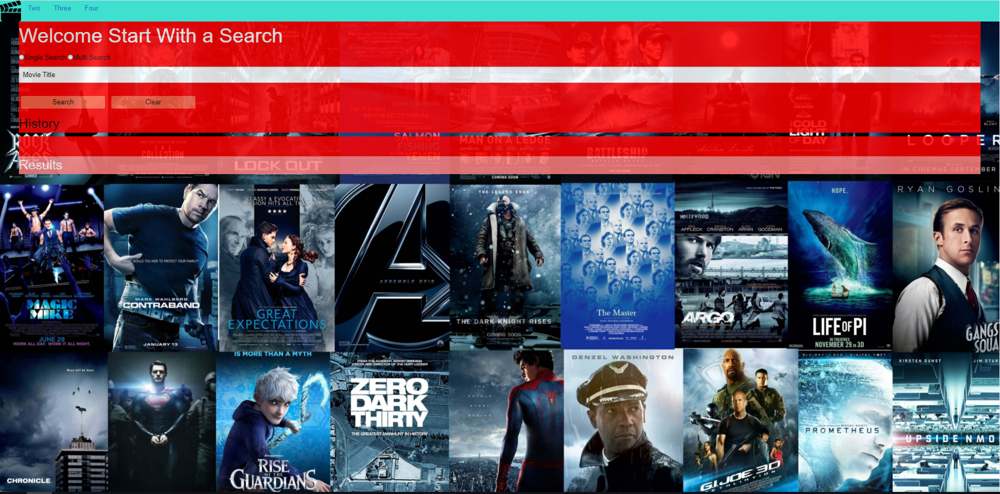

# MovieSynopsis

## Summary
Allows user to search for a single movie or multi movies at once. With the single movie search, the title, genres, plot, movie poster, rated, runtime, release date, and where you can watch the movie. With multi movie search, it will display the title, release year, movie poster, and the type of media it is.

## User Story
People spend so much extra time searching for movies. With this program, people can find movies faster based of their search and actually sit back, relax, and enjoy the movie they found.

## Tech Used:

**Built-with:
-HTML
-CSS
-Foundation
-Javascript/jQuery
-AJAX
-Utelly API
-OMDB API

## Live Link
https://jhohing.github.io/MovieSynopsis/

## Screen Shot

